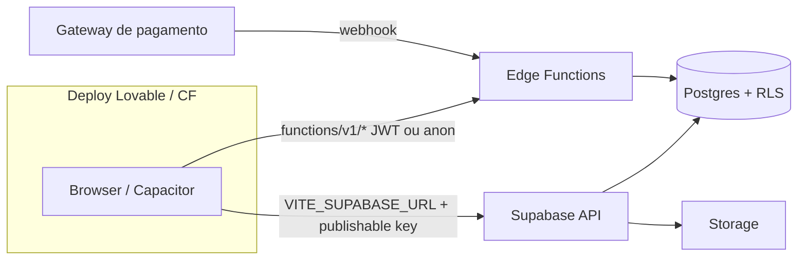

# Integração com backend e deploy (Lovable / produção)

Este documento alinha o **fluxo operacional** (Digital Signage) e o **SaaS** (planos, checkout, faturas) com o **Supabase** (Postgres, RLS, Auth, Storage, Edge Functions) e com o alojamento no **Lovable** (ou domínio próprio com as mesmas variáveis).

Ver também: [operational-flow.md](./operational-flow.md) (mermaid de pareamento, playlist e provas de exibição).

---

## 1. Onde a app corre



- **Lovable (preview/prod):** definir `VITE_SUPABASE_URL` e chave pública (publishable) nos secrets do projeto, mais `PUBLIC_APP_URL` no servidor/edge para links de e-mail, conforme `.env.example` e `docs/checklists/production-checklist.md`.
- **Nunca** colocar `service_role` no frontend.

---

## 2. Fluxo SaaS: planos → checkout → pagamento

```mermaid
sequenceDiagram
  participant U as Utilizador
  participant P as Página /planos (anon)
  participant Ch as /checkout
  participant EF as create-checkout-session
  participant G as Gateway (futuro)
  participant W as payment-webhook
  U->>P: Ver planos (RLS read plans ativos)
  U->>Ch: Seleciona plano (plan code)
  Ch->>EF: POST plan_id, JWT
  Note over EF: Grava checkout_sessions (stub; checkout_url nulo)
  EF-->>Ch: id + message / checkout_url
  Ch->>G: (Produção) redireciona se URL preenchida
  G->>W: evento pago
  W->>W: Atualiza payments, invoices, licenses (lógica do provider)
```

**Estado atual:** a Edge Function `create-checkout-session` cria a linha em `checkout_sessions` e devolve `checkout_url: null` até o adaptador (Stripe, Mercado Pago, Pagar.me, etc.) ser configurado com secrets e o URL preenchido em código.

**Checkout no frontend:** a página `checkout` chama `supabase.functions.invoke('create-checkout-session', { body, headers via sessão })` e exige **sessão autenticada**; o login suporta `?redirect=/checkout?...` (redirect interno validado em `isSafeInternalRedirect`).

---

## 3. Fluxo de painel / signage (síntese)

| Etapa | Backend | Estado |
|------|---------|--------|
| Login / org / perfis | Supabase Auth + `profiles` + RLS | Integrado no app autenticado |
| Pareamento TV | `pair-screen`, `create-pairing-code`, RLS + RPCs | Integrado (player) |
| Heartbeat e online | `heartbeat-screen` + tabelas `screens` | Integrado |
| Resolver playlist | `device-resolve-playlist` / `resolve-screen-playlist` | Integrado |
| Provas de exibição | `generate-proof-of-play` + `playback_logs` | Conforme migrations / policies |
| Relatórios / export | `export-report` | Chamar a partir de UI quando a rota fizer a acção (ver gap abaixo) |
| Health diário | `daily-health-check` | Agendar (cron) no Supabase ou externo; não acionado sozinho pela UI |
| Faturas / admin SaaS | Tabelas `invoices`, `subscriptions`, `payments` + hooks React Query | Integrado no painel master e super admin |
| MRR histórico (gráfico) | Não existe série temporal dedicada | Gráfico usa MRR agregado; ver secção 5 |

---

## 4. Matriz de gaps (ações de produção)

| Área | O que fazer |
|------|------------|
| **Asaas (BR)** | Definir `ASAAS_API_KEY`, `ASAAS_API_BASE`, `ASAAS_WEBHOOK_TOKEN` (ver [docs/integrations/asaas.md](../integrations/asaas.md)). |
| **Assinaturas a partir do checkout** | Mapear `organization_id` do utilizador na sessão, criar/atualizar `subscriptions` e `invoices` no webhook. |
| **Ações de assinatura (UI)** | Downgrade, cartão, cancelamento: implementar server actions ou funções com Service Role a partir de papéis permitidos. |
| **export-report** | Ligar botões em `relatorios` (ou agendado) a invocação com JWT e descarga. |
| **daily-health-check** | `cron.schedule` (Supabase) ou GitHub Action com `supabase functions invoke` + service. |
| **Redirect Auth Lovable** | Incluir origem de deploy em `Authentication > URL configuration` (documentado no checklist de produção). |
| **Capacitor / TV** | `CAPACITOR_SERVER_URL` / player aponta para a mesma origem HTTPS pública. |

---

## 5. Rotas de conveniência (redirect)

Rotas de primeiro nível (`/dashboard` → `/app`, `/faturas` → `/app/faturas`, `/admin` → `/admin-saas`, etc.) existem para links curtos e marketing; o painel canónico continua em `/app/*` e o admin SaaS em `/admin-saas/*`.

---

## 6. Referência rápida de Edge Functions (pasta do repo)

Operação: `pair-screen`, `create-pairing-code`, `check-pairing-status`, `device-confirm-pairing`, `device-reset-pairing`, `heartbeat-screen`, `device-resolve-playlist`, `resolve-screen-playlist`, `send-alert`, `publish-campaign`, `media-postprocess`, `export-report`, `generate-proof-of-play`, `daily-health-check`.

SaaS: `create-checkout-session`, `payment-webhook`, `get-saas-context`, `validate-plan-limits`.

---

*Última atualização: análise de integração com o repositório signix-display-pro.*
