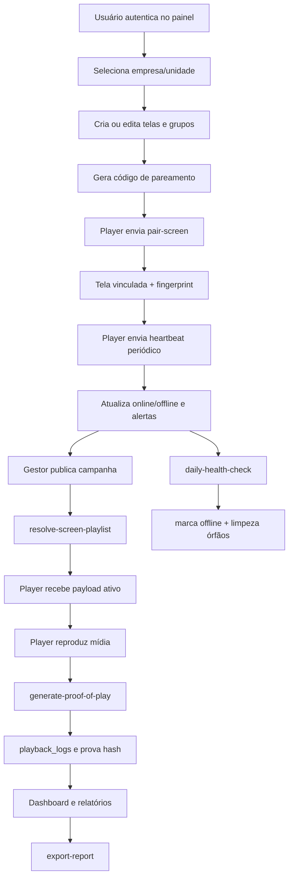

# Fluxograma Operacional

Integração com deploy (Lovable) e com camada SaaS: ver [lovable-saas-and-signage-integration.md](./lovable-saas-and-signage-integration.md).

## Regras centrais no fluxo

- Isolamento por `organization_id` em todo recurso sensível.
- RLS para impedir leitura cruzada entre empresas.
- Priorização de campanha por período + alvo + prioridade + agenda.
- Logs de auditoria automáticos para entidades críticas.
